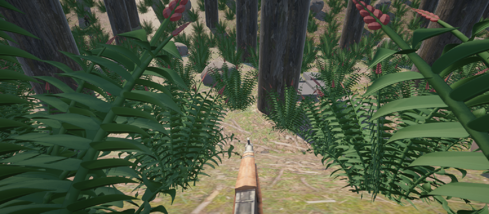
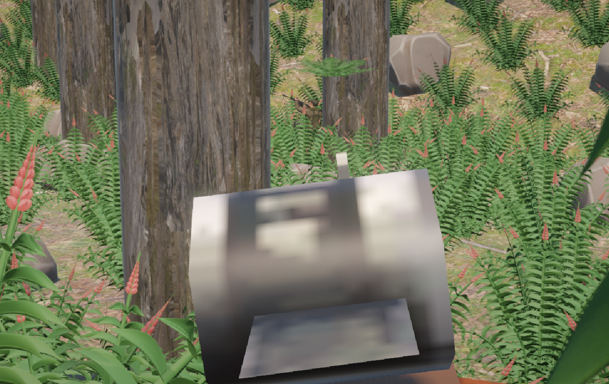
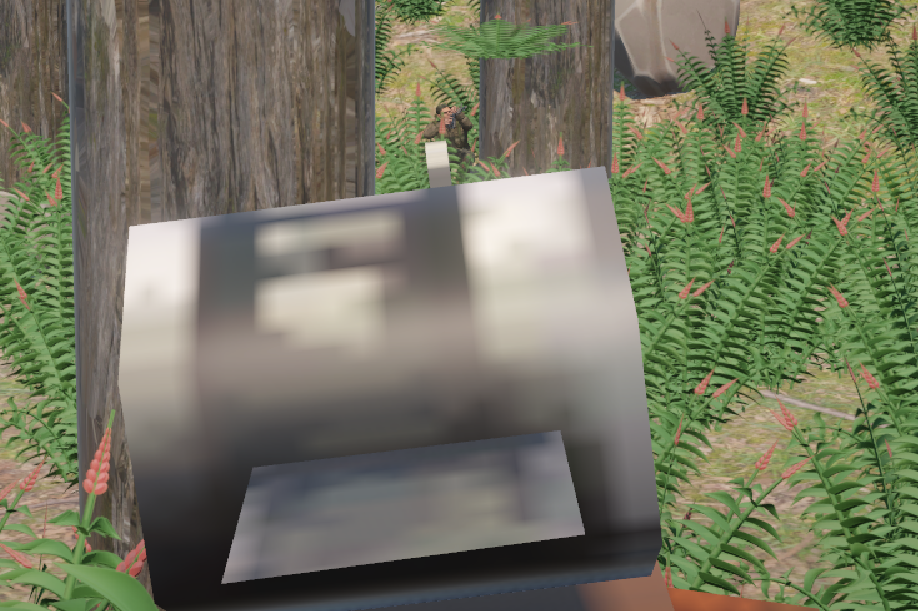
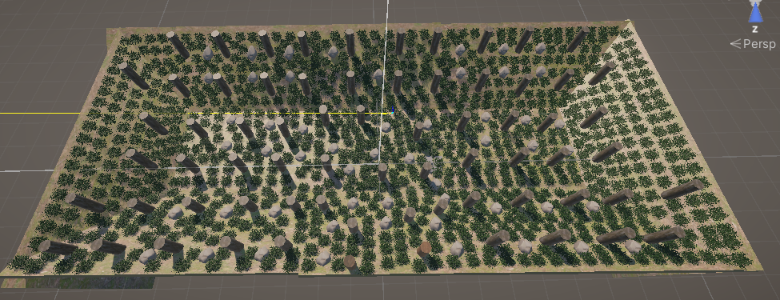

# STILL HUNT

### Unity / C# Tactical AI Prototype

> **Could you find the enemy without fighting?**

Still Hunt is a tactical 1v1 hunting and stealth prototype built in Unity and C#.

The project focuses on observation, positioning, concealment, navigation, and AI behavior rather than simply relying on direct combat.

The goal is to create encounters where understanding movement and environmental clues can be more important than shooting first.

---

## Gameplay Demo

A short gameplay demonstration of the current Still Hunt prototype.

[Watch / download gameplay demo](./Portfolio/Video/still-hunt-encounter-clip01.mp4)(./Portfolio/Video/StillHunt-Encounter-p-v-ai.mp4)

The demonstration shows:
- Player movement
- Observation
- Cover interaction
- Guard patrol behavior
- AI navigation recovery
- Tactical encounter flow

### Cover System

- Environmental cover interaction
- Cover positioning using rocks, trees, logs, grass, and bushes
- Cover-angle interactions
- Visibility and concealment considerations

### Aiming & Combat

- Right-click aiming
- Tactical aiming system
- Hit detection
- Near-miss feedback
- Hit feedback
- Projectile / shot direction handling

---

## Guard AI

The Guard AI is one of the main engineering systems in Still Hunt.

The guard can:

- Patrol between designated PatrolPoints
- Detect obstacles while navigating
- Monitor movement progress
- Detect when movement has stalled
- Search for alternative recovery PatrolPoints
- Validate recovery routes
- Move toward a valid recovery position
- Resume movement toward the original objective
- React to suppression
- Use concealment and hiding behavior

The system is designed to prevent the AI from simply remaining permanently stuck when its original navigation path becomes problematic.

---

## Navigation Recovery

One of the main technical features is the Guard AI recovery system.

### Recovery Flow

```text
Guard follows patrol objective
        ↓
Movement is obstructed
        ↓
Movement progress is monitored
        ↓
Guard detects a possible stuck state
        ↓
Search for a recovery PatrolPoint
        ↓
Validate the recovery route
        ↓
Move to recovery position
        ↓
Resume original objective


```
This system was developed to make AI navigation more resilient to obstacles and environmental conditions.


## Technical Highlights
The project demonstrates practical Unity and C# development involving:
- C# gameplay programming
- Unity component architecture
- CharacterController movement
- AI state and behavior logic
- Patrol navigation
- Movement-progress monitoring
- Stuck detection
- Recovery navigation
- Obstacle detection
- Route validation
- Environmental interaction
- Tactical cover systems
- Aiming and hit detection
- Debugging and iterative gameplay testing

## Technology
- Engine: Unity 2022.3.62f3
- Language: C#
- Platform: Windows
- Version Control: Git / GitHub
- Large Files: Git LFS

## Controls
| Action | Input |
|---|---|
| Click-to-Move | [SPACE BAR] + Left Mouse Button |
| Aim | Right Mouse Button |
| Cover Interaction | C |
| Crouch | [LEFT SHIFT] |


## Development Status
Active Development — Prototype
The current build focuses on the core player, cover, combat, environment, and AI navigation systems.
The project is still being developed and refined.
Features are intentionally documented as implemented, testing, or planned rather than presented as finished systems.

## Planned Systems
Future development may include:
- Environmental disturbance clues
- Footprint tracking
- Bird and wildlife reactions
- Branch and vegetation disturbance
- Additional deception behaviors
- More advanced tactical AI behavior
- Additional environmental interactions
- Further combat and hunting mechanics

## Third-Party Assets & Credits
Still Hunt uses third-party assets during development. These assets are not presented as original work.
Army Soldier Character
- Creator: joneborden123
- Source: Sketchfab
- License: Creative Commons Attribution (CC BY)
The Army Soldier Character is used by the Guard character in the current prototype.

Toon Soldiers WW2 Demo
- Creator/Publisher: Polygon Blacksmith
- Source: Unity Asset Store
- License: Unity Asset Store license
Used as third-party development content.

Mixamo
Mixamo animations are used for character animation and prototyping.

Poly Haven
Poly Haven assets are used for environment development where applicable.

## Project Structure

This public repository contains portfolio-safe material for Still Hunt:

StillHunt-Portfolio/
├── Portfolio/
│   ├── Screenshots/
│   └── Video/
├── Scripts/
└── README.md

The full Unity development project and third-party source assets are kept separately in the private development repository.

## Screenshots

### Gameplay



### Aiming



### AI Encounter



### Forest Map


## Gameplay Demo
A gameplay demonstration video will be added here.
The planned video will demonstrate:
- Player movement
- Observation
- Cover interaction
- Guard patrol behavior
- AI navigation recovery
- Tactical encounter flow

## Playable Build

[Download Still Hunt v1.0.0 - Windows](https://github.com/LeoNerdTornado/StillHunt-Portfolio/releases/latest)

## Development Philosophy
Still Hunt is being developed as both a game prototype and a software engineering portfolio project.

The project emphasizes:
- Building systems rather than isolated features
- Testing behavior in the actual game environment
- Debugging problems instead of hiding them
- Designing AI that can respond to unexpected situations
- Iterating on gameplay through repeated testing
The goal is not simply to create a playable scene, but to demonstrate the ability to design, implement, debug, and maintain interconnected gameplay systems.

## Author
LeoNerdTornado
Still Hunt is an independently developed Unity/C# prototype.

